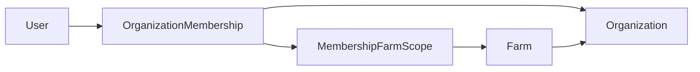

# Modelo de identidade e tenancy

## Modelo

- `app.users` representa a identidade global interna. Seu UUID corresponderá ao claim `sub` do Supabase Auth, sem FK para `auth.users`; e-mail é opcional e nenhuma senha ou token é armazenado.
- `app.organizations` representa o tenant. Toda fazenda e todo vínculo organizacional apontam para uma organização existente.
- `app.farms` representa uma propriedade operacional e possui `tenant_id` obrigatório.
- `app.organization_memberships` vincula um usuário global a uma organização com role `OWNER`, `ADMIN`, `MANAGER`, `OPERATOR` ou `VIEWER`. Roles organizacionais não representam planos ou papéis comerciais de assinatura.
- `app.membership_farm_scopes` limita memberships em modo `SELECTED_FARMS`. O modo `ALL_FARMS` não exige linhas de escopo; a aplicação impedirá sua criação indevida.



## Integridade multi-tenant

`farms` e `organization_memberships` possuem chaves únicas compostas por `tenant_id` e `id`. As duas FKs de `membership_farm_scopes` incluem o mesmo `tenant_id`, portanto o PostgreSQL rejeita tanto um membership quanto uma fazenda pertencente a outro tenant. Organizações, fazendas, usuários e memberships usam exclusão restrita; arquivamento ou revogação deve ser o fluxo normal.

Os índices operacionais iniciais são:

- `farms (tenant_id, status)`;
- `organization_memberships (tenant_id, status)`;
- `organization_memberships (user_id, status)` para localizar os tenants de um usuário global;
- `membership_farm_scopes (tenant_id, farm_id)`.

Constraints únicas já fornecem os demais índices necessários e não foram duplicadas.

## Segurança em camadas

O caminho suportado é:

```text
Clientes -> API Spring -> PostgreSQL
```

O schema `app` não está na lista exposta pelo PostgREST. A role `app_api` é `NOLOGIN`, não possui superusuário nem `BYPASSRLS` e recebe somente privilégios explícitos no schema da aplicação.

Dentro de uma futura transação, a API validará identidade, membership e fazenda antes de configurar:

```sql
select set_config('app.current_tenant_id', '<tenant-uuid>', true);
```

O valor local desaparece ao terminar a transação. A função `app.current_tenant_id()` fornece esse UUID às policies RLS de organizações, fazendas, memberships e escopos. RLS não substitui autorização nem o filtro explícito por tenant nos futuros repositories.

## Supabase Auth

A próxima etapa validará o JWT, usará o `sub` para sincronizar `app.users` e resolverá com segurança o tenant e a fazenda ativos. Até lá não existe integração HTTP, cliente do Supabase Auth ou configuração obrigatória de `DataSource` na aplicação principal.
